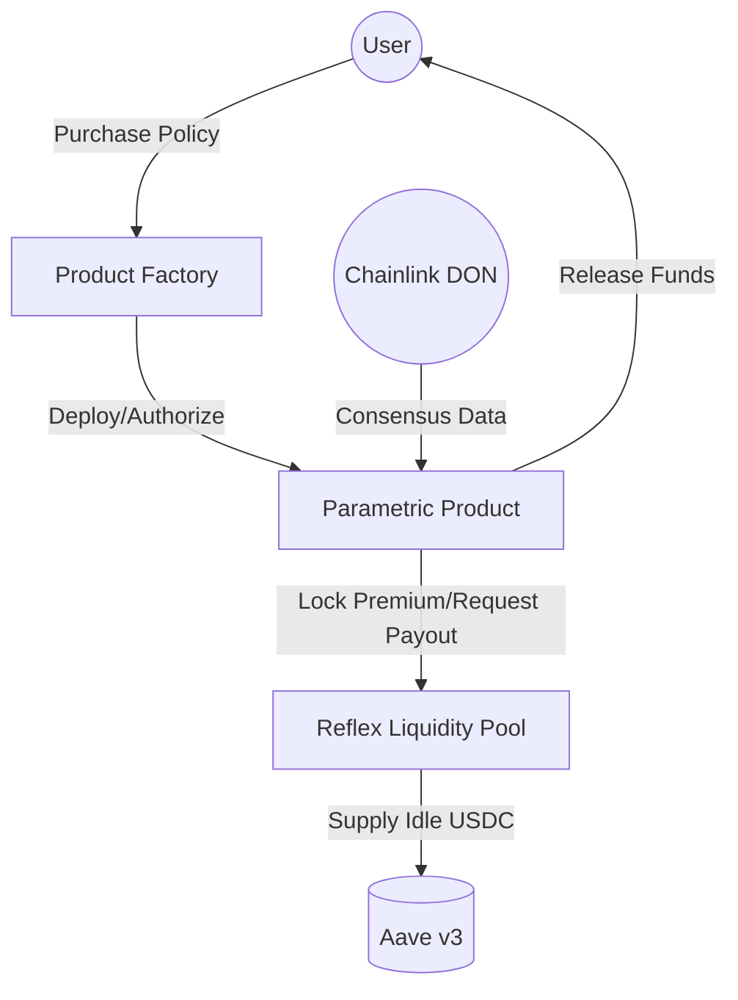

# Reflex — Protection Market for Parametric Micro-Insurance

Reflex is a decentralized **Protection Market** for parametric micro-insurance built on Avalanche. It allows users and businesses to hedge against real-world risks (weather, travel, catastrophe, energy) using transparent, code-driven policies triggered by Chainlink Decentralized Oracle Networks (DONs).

## 🚀 Core Value Proposition
- **Instant Settlement**: No manual claims adjusting. Smart contracts pay out the moment oracle data verifies a trigger.
- **Deep Liquidity**: A shared USDC liquidity pool with Aave v3 integration for capital efficiency.
- **Parametric Variety**: 5 distinct risk products with diverse mathematical payout models (Linear, Tick, Tiered, Binary).
- **Security First**: 640k+ invariant tests and hardened contracts with reentrancy guards and payout caps.

---

## 🏗️ Protocol Architecture



### 1. Reflex Liquidity Pool (`ReflexLiquidityPool.sol`)
The central treasury of the protocol. It handles LP deposits, maintains protocol solvency invariants, and releases payouts when authorized by verified product contracts. Idle capital is automagically routed to Aave v3 to generate yield for LPs.

### 2. Product Factory (`ProductFactory.sol`)
An administrative contract used to deploy and authorize new parametric risk products, ensuring they satisfy the protocol's interface and security standards.

### 3. Parametric Products (`IParametricProduct.sol`)
Stateless logic contracts that define the risk parameters, oracle sources, and payout calculations. 
- **TravelSolutions**: Binary delay trigger (>120m).
- **AgricultureIndex**: Linear scaling between Strike and Exit rainfall indexes.
- **EnergySolutions**: Tick-based payout per Heating/Cooling Degree Day.
- **CatastropheProximity**: Tiered payouts based on earthquake epicenter distance.
- **MaritimeSolutions**: Binary wind speed trigger.

---

## 🛠️ Tech Stack

| Component | Technology |
|---|---|
| **Smart Contracts** | Solidity 0.8.24, Foundry, OpenZeppelin UUPS |
| **Oracles** | Chainlink Functions (DON), Keepers |
| **Defi Integration** | Aave v3 (Supply/Withdraw) |
| **Frontend** | Next.js 14, TypeScript, Tailwind, Wagmi/Viem |
| **Relayer** | Node.js, Ethers.js v6, zkTLS Simulations |
| **Infrastructure** | Avalanche Fuji / custom L1 |

---

## 🏁 Quick Start

### Prerequisites
- Node.js ≥ 20
- Foundry
- Avalanche Fuji Testnet Funds

### 1. Smart Contracts
```bash
cd contracts
forge install
forge build
# Run security invariants (requires local node or fuji fork)
forge test --match-path test/SecurityInvariants.t.sol -vv
```

### 2. Relayer
```bash
cd relayer
npm install
npm run dev
```

### 3. Frontend
```bash
cd frontend
npm install
npm run dev
# Open http://localhost:3000
```

---

## 🧬 Security & Invariants
Reflex maintains strict protocol invariants verified via stateful fuzzing:
1. **Solvency**: `Pool Assets >= Sum(Max Payouts)` of all active policies.
2. **Capital Efficiency**: Idle assets remain in Aave while preserving withdrawal liquidity.
3. **Hard Caps**: Every policy is capped at `$10M` to prevent catastrophic drain via oracle failure.
4. **Access Control**: Critical functions are restricted to `onlyOwner` (Multisig) or `onlyProduct`.

---

## 📄 Documentation
For detailed mathematical formulas and API references, see the in-app [Documentation](http://localhost:3000/docs).

## ⚖️ License
MIT
